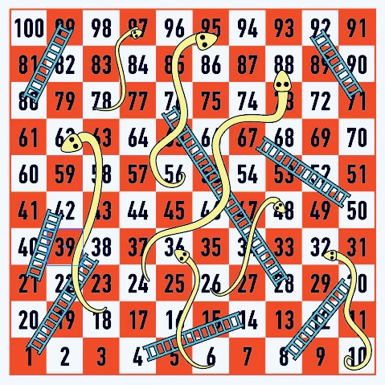

# Boardgame Tester

This script simulates “snakes and ladders” style games in an abstract way to generate statistics about the number of turns taken to finish.

***

## Parameters

Set the customisable parameters based on the game you want to simulate.

- *Runs*: How many times to simulate the game. It should be able to run hundreds of thousands of times in a few seconds.
- *Start*: The square players begin on. Usually 0.
- *Finish*: The square players finish on. 
- *Ladders*: This dictionary represents the snakes or ladders on the game (or any abstract equivalent). Each integer key-value pair represents moving from one square to another in the format `{ from : to }`.

***

The default parameters simulate this Snakes and Ladders board. 



The script prints summary statistics and a histogram.
```
Games: 100000

Stats for number of moves

Mean: 46.31
SD: 33.1
Median: 36.0
Mode: 21
Min: 6
Max: 381

Played the game 100000 times in 9.79 seconds.
```


